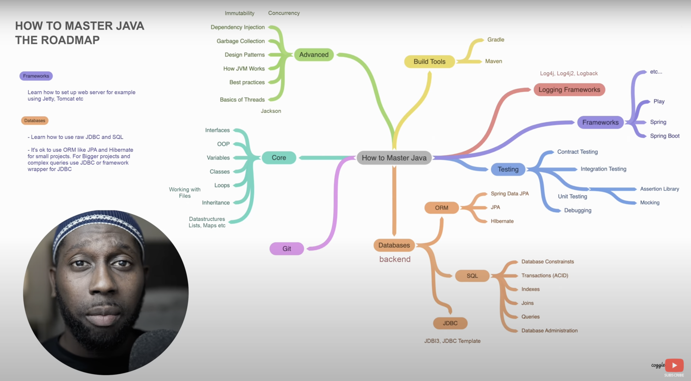

# prerequisites-and-extra-tutorials

It is recommended that you understand the material here before attempting the main Spring Boot Roadmap sections. 
This section specifically is derived from: [How To Master Java - Java for Beginners Roadmap](https://www.youtube.com/watch?v=TE3LyYW-AHQ)

## Table of Contents
[i. Prerequisites](#i-prerequisites)
 
&nbsp;&nbsp;&nbsp;&nbsp;&nbsp;[1. Java Core](#1-java-core)
 
&nbsp;&nbsp;&nbsp;&nbsp;&nbsp;[2. Databases](#2-databases)
 
&nbsp;&nbsp;&nbsp;&nbsp;&nbsp;[3. Build Tools](#3-build-tools)
 
[ii. Extra](#ii-extra)
 
&nbsp;&nbsp;&nbsp;&nbsp;&nbsp;[1. Git](#1-git)
 
&nbsp;&nbsp;&nbsp;&nbsp;&nbsp;[2. Logging / Documentation](#2-logging--documentation)
 

## i. Prerequisites

### 1. Java Core

It is important to understand the programming language of the framework you are trying to learn.
Spring Boot is an open source Java-based framework therefore you must be familiar with Java beforehand.

For Java, it is important to understand many concepts. This includes: OOP, Interfaces, Variables, Classes, Loops, Inheritance, Datastructures etc.

<ins>Supporting Material

[Java Core Guide (PDF)](Java_QuickReference_v1.1.pdf)
 
[Java Full Course (YouTube/AmigosCode)](https://www.youtube.com/watch?v=Qgl81fPcLc8)
 
[Learn Java in 14 Minutes (YouTube/AlexLee)](https://www.youtube.com/watch?v=RRubcjpTkks)
 

### 2. Databases

A full stack developer must be familiar with backend development and more specifically, databases. A database in a web application is a way of storing and organising the data for your application. There are many types of databases to learn, but here are a few popular ones: SQL, MySQL, NoSQL and MongoDB.

One must be familiar with ORM (Object-Relational Mapping) tools such as Spring Data JPA or Hibernate. You must know JDBC (Java Database Connectivity) also.

SQL is a domain-specific language used in programming and designed for managing data held in a relational database management system (RDBMS).

MongoDB is a source-available cross-platform document-oriented database program. Classified as a NoSQL database program, MongoDB uses JSON-like documents with optional schemas.

<ins>Supporting Material

[SQL Basics Cheat Sheet (PDF)](sql-basics-cheat-sheet-ledger.pdf)
 
[MongoDB Cheat Sheet (PDF)](MongoDB-Dark.pdf)
 
[JDBC vs JPA vs Hibernate vs Spring Data JPA in 9 minutes (YouTube/JavaMaster)](https://www.youtube.com/watch?v=GX3D0OIFOhE)
 

### 3. Build Tools

Build tools are commonly known as programs that automate the process of building an executable application from source code. This building process includes activities like compiling, linking and packaging the code into an executable form.
Following is the list of Open source Java Builds: Apache Maven, Ant with ivy, Gradle and SBT.

Maven’s scalability and extensibility make it an attractive choice for small development teams who need automated builds but don’t have a lot of resources allocated toward software engineering overhead.

<ins>Supporting Material

[What Is Maven? (YouTube/Simplilearn)](https://www.youtube.com/watch?v=bSaBmXFym30)
 

## ii. Extra

### 1. Git

Git is a free and open source software for distributed version control: tracking changes in any set of files, usually used for coordinating work among programmers collaboratively developing source code during software development.

GitHub and Git commands can be used in the Terminal therefore it is ideal to be familiar with Linux/UNIX bash commands. 

<ins>Supporting Material

[Bash Cheat Sheet (GitHub)](https://github.com/RehanSaeed/Bash-Cheat-Sheet)
 
[Git Cheat Sheet (PDF)](git-cheat-sheet.pdf)
 
[What is Git? Explained in 2 Minutes! (YouTube/ProgrammingWithMosh)](https://www.youtube.com/watch?v=2ReR1YJrNOM)
 
[Git And GitHub in ~30 Minutes (YouTube/TechWithTim)](https://www.youtube.com/watch?v=jG4Vs81kMlc)
 

### 2. Logging / Documentation

Logging is a means of tracking events that happen when some software runs. Logging is important for software developing, debugging, and running. If you don't have any logging record and your program crashes, there are very few chances that you detect the cause of the problem. 

The most popular java logging frameworks are Log4j2 and Logback. They have a predecessor in Log4j. SLF4J is a logging facade that provides a common interface for different logging frameworks.

Swagger UI, a part of Swagger, is an open source tool that generates a web page that documents the
APIs generated by the Swagger specification. 
This UI presentation of the APIs is user friendly and easy to understand, with all logic 
complexity kept behind the screen.

<ins>Supporting Material (Logging)

[Logback vs SLF4J vs Log4J2 - what is the difference? (YouTube/JavaBrains)](https://www.youtube.com/watch?v=SWHYrCXIL38)
 
[How to do logging in Spring Boot (YouTube/JavaBrains)](https://www.youtube.com/watch?v=lGrcZsw-hKQ)
 

<ins>Supporting Material (Documentation)

[How to add Swagger to Spring Boot (YouTube/JavaBrains)](https://www.youtube.com/watch?v=gduKpLW_vdY)
 
[How to configure Swagger in Spring Boot (YouTube/JavaBrains)](https://www.youtube.com/watch?v=8s9I1G4tXhA)
 
